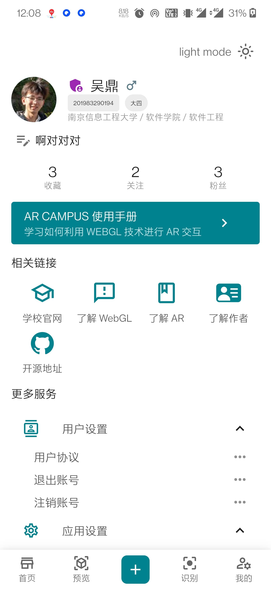
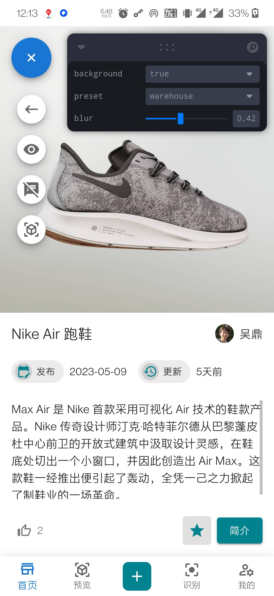
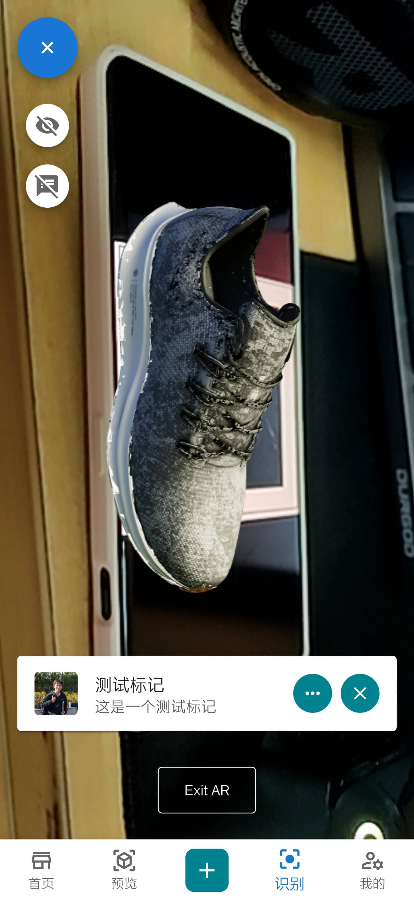

# Collage-BachelorThesis

本人的本科毕业论文：基于 WebGL 的 AR 校园交互系统。有三个主要模块：用户，WebGL，AR。更完善的系统介绍可以查看 `docs/thesis/NUIST_thesis.pdf`


该系统仅用于提交毕业设计，是一个 demo，后续不准备进一步开发与维护。部分模块没有得到很好地重构，但不准备继续完善了。

### 系统说明

系统的核心功能位于前端，即使不启用后端也能体验绝大部分功能，但无法做持久化。

#### 前端启动方式

在 `app/front` 目录下运行如下指令:

```bash
npm install
npm run dev
```

#### 后端启动方式

启动 `app/back` 项目，需要 mysql 8+，运行 `app/back/src/main/sql` 下的脚本。修改 `app/back/src/main/resources/application.yml` 中的数据库配置信息。运行项目。

### 系统功能

#### 用户模块

仿照 bilibili 客户端做的 UI 设计：



#### WebGL 模块

提供了三维物品预览功能：



#### AR 模块

提供了 AR 预览与识别功能（识别功能存在 bug）:



### 使用到的主要技术

#### 前端

- [react](https://react.dev/)
- [@mui/material](https://mui.com/material-ui/)
- [@react-three/fiber](https://docs.pmnd.rs/react-three-fiber/getting-started/introduction)
- [@ar-js-org/ar.js](https://ar-js-org.github.io/AR.js-Docs/)

#### 后端

- [SpringBoot](https://spring.io/projects/spring-boot/)
- [Spring Data JPA](https://spring.io/projects/spring-data-jpa)